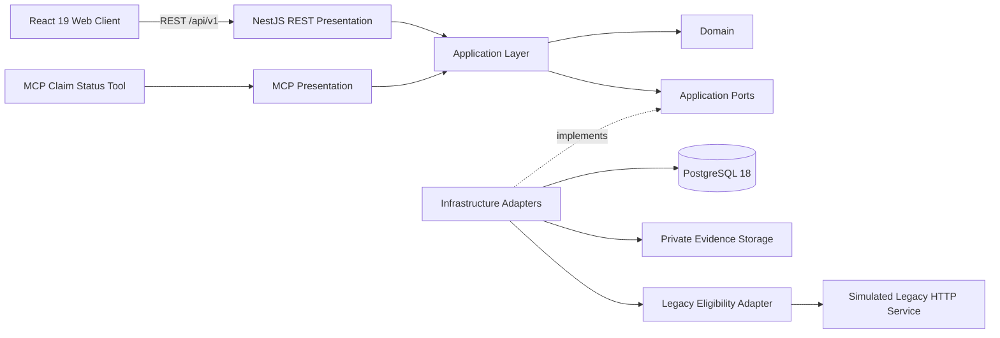

# Insurance Claims Legacy Modernization

**Portfolio modernization MVP demonstrating how a legacy-dependent insurance claims workflow can be modernized incrementally without coupling the new experience to the legacy core.**

[](https://github.com/LuisHdezE/InsuranceClaims/actions/workflows/api-qa.yml)
[](https://github.com/LuisHdezE/InsuranceClaims/actions/workflows/integration-qa-web.yml)
[](https://github.com/LuisHdezE/InsuranceClaims/actions/workflows/operations-observability.yml)
[](https://github.com/LuisHdezE/InsuranceClaims/actions/workflows/openapi-validation.yml)

> **Case-study disclaimer**  
> This is an unofficial technical case study inspired by publicly observable insurance workflows. There is no affiliation with FAR Seguros. All policy, claim, operator and operational data in this repository are synthetic/demo data. Legacy coexistence is **SIMULATED**.

## At a glance

| | |
|---|---|
| **Delivery model** | GREENFIELD modernization MVP with simulated legacy coexistence |
| **Blueprint** | Software Development Blueprint **0.5.2**, full lifecycle completed |
| **Architecture** | Clean Architecture + Ports & Adapters |
| **Backend** | Node.js 24, NestJS 12, TypeScript |
| **Frontend** | React 19, Vite 7, TypeScript |
| **Persistence** | PostgreSQL 18, authoritative for the modern workflow |
| **Contracts** | REST `/api/v1`, OpenAPI 3.1, Postman, separate read-only MCP tool |
| **Accepted web slices** | **3 / 3** |
| **Release Gate** | **PASS** |
| **Operations** | **COMPLETE / 100%** with executable observability evidence |

## What this MVP demonstrates

The project modernizes three user-facing claim journeys while keeping the new application insulated from the simulated legacy dependency:

1. **Digital Claim Intake**  
   Policy/vehicle verification, claim creation, evidence submission, idempotency, validation and resilient error handling.

2. **Customer Claim Tracking**  
   Proof-bound claim lookup with a customer-safe projection, invalid-proof handling and degraded/offline transport states.

3. **Claims Backoffice**  
   Operator authentication, claim listing/detail, protected evidence download, lifecycle transitions, authorization and stale-state concurrency protection.

The supporting platform also includes:

- eight business REST operations plus liveness/readiness routes;
- a separate read-only `MCP:get_claim_status` presentation boundary;
- PostgreSQL-backed modern claim state, audit and idempotency data;
- private synthetic evidence storage behind a port;
- a separate HTTP legacy simulator used only for synthetic policy/vehicle eligibility;
- executable API, browser, security, accessibility, responsive, backup/restore and observability QA.

## Product walkthrough

<table>
  <tr>
    <td width="50%"><strong>Digital claim intake</strong><br></td>
    <td width="50%"><strong>Customer claim tracking</strong><br></td>
  </tr>
  <tr>
    <td width="50%"><strong>Claims backoffice</strong><br></td>
    <td width="50%"><strong>Claim detail & lifecycle</strong><br></td>
  </tr>
</table>

Additional desktop/mobile and error-state captures are versioned under [`documentation/visual-functional-review/generated/assets`](documentation/visual-functional-review/generated/assets).

## Architecture



### Boundary rules

```text
REST -> Application -> Ports -> Infrastructure
MCP  -> Application -> Ports -> Infrastructure
React -> REST API
Legacy Adapter -> Legacy Port
```

The following shortcuts are intentionally forbidden:

```text
React -X-> PostgreSQL
React -X-> Legacy
MCP   -X-> PostgreSQL
```

PostgreSQL is authoritative for the modern claims workflow. The simulated legacy service is authoritative only for its synthetic policy/vehicle eligibility dataset.

For the full rationale and conformance evidence, see [`documentation/architecture/ARCHITECTURE.md`](documentation/architecture/ARCHITECTURE.md) and [`documentation/architecture/ARCHITECTURE_IMPLEMENTATION_CONFORMANCE.md`](documentation/architecture/ARCHITECTURE_IMPLEMENTATION_CONFORMANCE.md).

## Security and reliability highlights

- short-lived JWT operator authentication;
- API-side RBAC and permission enforcement;
- Argon2id operator password hashing;
- idempotent claim creation using `Idempotency-Key`;
- expected-state concurrency guard for claim transitions;
- RFC 9457 Problem Details;
- request correlation and durable audit correlation;
- safe error sanitization and secret non-leakage assertions;
- protected evidence download and private evidence storage port;
- rate limiting;
- PostgreSQL backup/restore proof with `pg_dump` and `pg_restore`;
- liveness/readiness endpoints and executable observability checks.

The complete threat/security model lives in [`documentation/security/SECURITY_THREAT_MODEL.md`](documentation/security/SECURITY_THREAT_MODEL.md).

## API surface

### Business REST operations

| Operation ID | Purpose |
|---|---|
| `verifyPolicyVehicle` | Verify synthetic policy/vehicle eligibility through the legacy adapter |
| `createClaim` | Create a modern claim with idempotency protection |
| `trackClaim` | Return a proof-bound customer-safe claim projection |
| `authenticateOperator` | Authenticate a backoffice operator |
| `listClaims` | List authorized backoffice claims |
| `getClaimDetail` | Retrieve protected claim detail |
| `downloadClaimEvidence` | Download protected synthetic evidence |
| `transitionClaimStatus` | Transition claim lifecycle with concurrency protection |

Operational routes expose liveness and readiness. MCP remains a separate presentation contract and is not disguised as a REST endpoint.

- OpenAPI: [`openapi.yaml`](openapi.yaml)
- Postman: [`postman/`](postman/)
- API contract: [`documentation/api/API_CONTRACT.md`](documentation/api/API_CONTRACT.md)

## Blueprint journey

This repository is also a worked consumer of **Software Development Blueprint 0.5.2**. The MVP progressed through the complete governed lifecycle:

```text
Discovery
  -> Target Definition
  -> Requirements & Domain
  -> Interface Scope Baseline
  -> Architecture / Security / Data
  -> API Contract Design
  -> API Implementation
  -> OpenAPI Validation
  -> Postman Contract
  -> API QA
  -> API Gate
  -> Interface Inventory
  -> Visual Identity
  -> Design System
  -> Client Architecture
  -> Functional Interface Slices
  -> Visual & Functional Review
  -> Integration QA
  -> Human Acceptance
  -> Release Gate
  -> Operations & Maintenance
```

All three web slices are `ACCEPTED`, Release Gate is complete and Operations is complete with observability evidence. The machine-readable project state is versioned in [`.blueprint/status.yaml`](.blueprint/status.yaml).

## Repository map

```text
apps/
  api/                  NestJS REST presentation
  mcp/                  Separate MCP presentation
  legacy-simulator/     Synthetic legacy HTTP dependency
  web/                  React client

packages/
  domain/               Domain model
  application/          Use cases and ports
  infrastructure/       PostgreSQL, evidence and legacy adapters

prisma/                 Persistence contract/tooling
documentation/          Architecture, security, QA, approvals and evidence
postman/                REST collection and safe local environment
qa/                     Runtime, browser, backup/restore and observability QA
scripts/                Architecture and Blueprint validation scripts
.blueprint/              Blueprint consumer state and slice contracts
```

## Local verification

### Requirements

- Node.js **24.x**
- PostgreSQL **18** for real persistence/runtime QA
- npm with lockfile installation

### Install and verify

```bash
npm ci
npm run contract:emit
npm run typecheck
npm test
npm run architecture:check
npm --workspace @insurance/web test
npm --workspace @insurance/web run build
npm audit --omit=dev --audit-level=high
```

### Run the local composition

Copy `.env.example` to a local environment file and replace demo secrets locally. Never commit real credentials.

With PostgreSQL prepared, run the services in separate terminals:

```bash
npm run start:legacy
npm run start:api
npm run start:mcp
npm --workspace @insurance/web run dev
```

Default ports from `.env.example` are API `3000`, MCP `3100` and legacy simulator `3200`. Vite uses its configured development port.

## QA strategy

Validation is intentionally broader than unit tests. The repository contains evidence and automation for:

- Domain/Application/API tests;
- executable architecture boundary checks;
- OpenAPI and Postman contract validation;
- real PostgreSQL runtime API QA;
- real Chrome functional journeys;
- API transport fidelity;
- security and authorization behavior;
- responsive and accessibility behavior;
- degraded/offline states;
- idempotency and concurrency behavior;
- `pg_dump` / `pg_restore` recoverability;
- request/audit correlation and secret non-leakage observability checks.

See [`documentation/integration-qa/`](documentation/integration-qa/), [`documentation/release/`](documentation/release/) and [`documentation/operations/`](documentation/operations/) for the evidence trail.

## Intentional MVP limitations

This repository is a **portfolio modernization MVP / technical case study**, not a production deployment for FAR Seguros or any insurer.

It does **not** claim:

- FAR production infrastructure or private internal processes;
- real insurer/customer data;
- production monitoring or on-call topology;
- production SLO/SLA or alert thresholds;
- production HA, replication, autoscaling or disaster-recovery topology;
- production backup schedules, RPO or RTO;
- production object storage or regulatory retention policy.

All business data is synthetic/demo data, and legacy coexistence is simulated by design.

## Release documentation

**Release candidate scope:** the governed MVP candidate covered the three accepted web slices and supporting platform described above. That candidate later received explicit human Release Gate approval, and the downstream Operations lifecycle was completed; the final machine-readable state is preserved in [`.blueprint/status.yaml`](.blueprint/status.yaml).

The governed MVP release posture, recoverability proof and limitations are documented in [`documentation/release/RELEASE_READINESS.md`](documentation/release/RELEASE_READINESS.md). Operations evidence is documented in [`documentation/operations/OPERATIONS_OBSERVABILITY_EVIDENCE.md`](documentation/operations/OPERATIONS_OBSERVABILITY_EVIDENCE.md).
