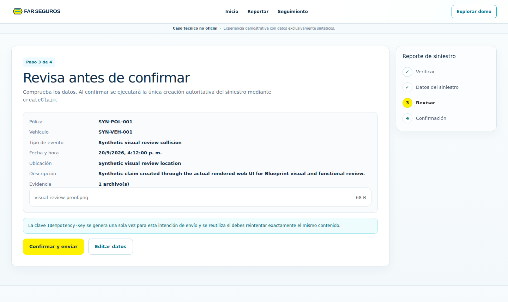
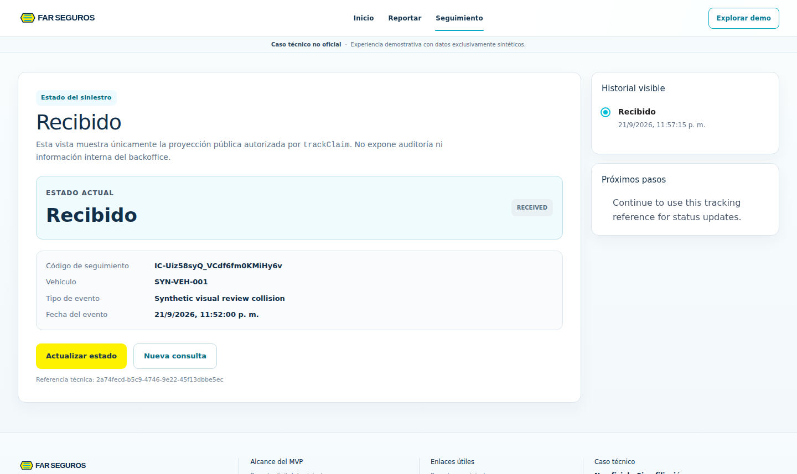
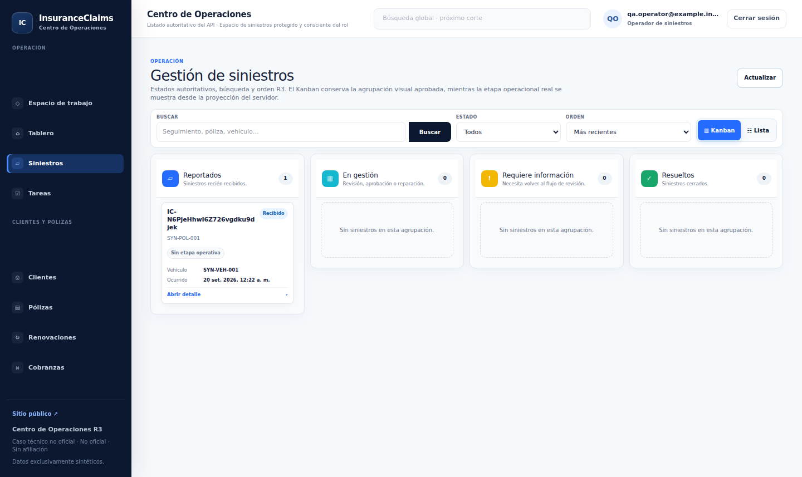
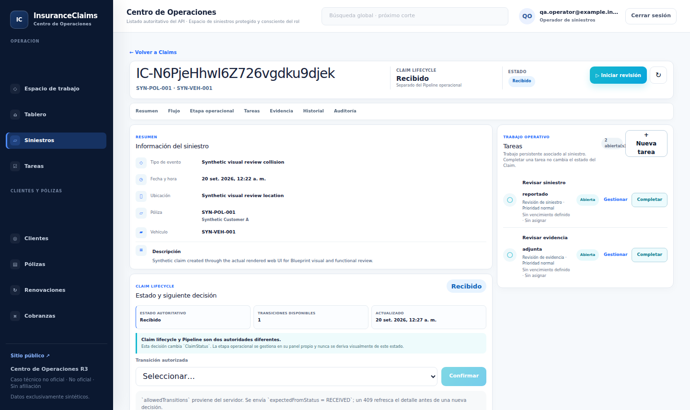
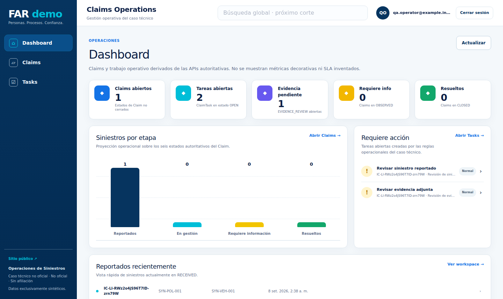
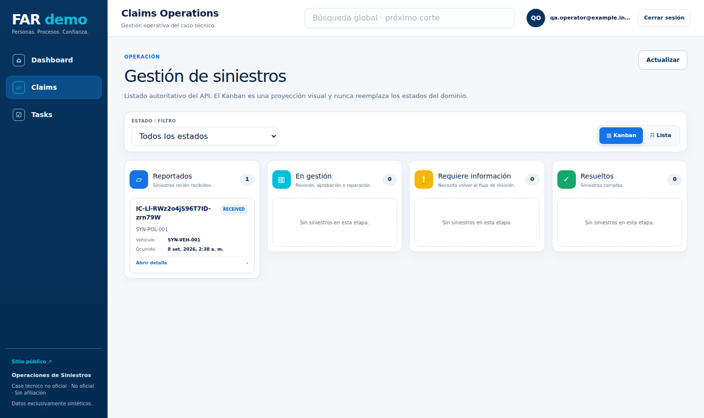
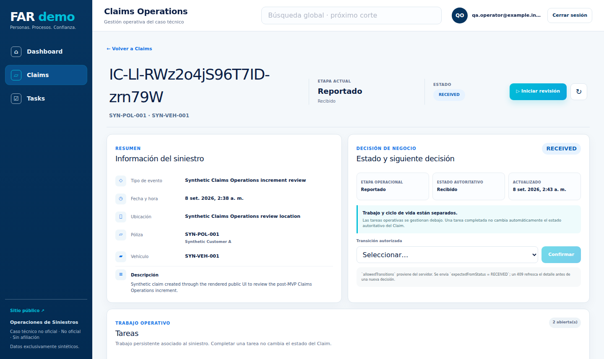
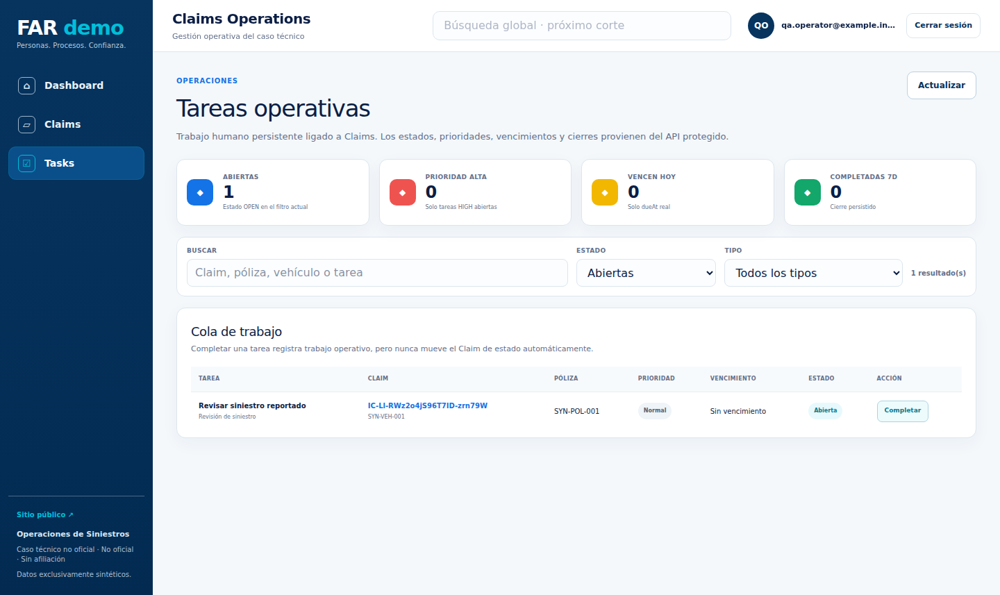
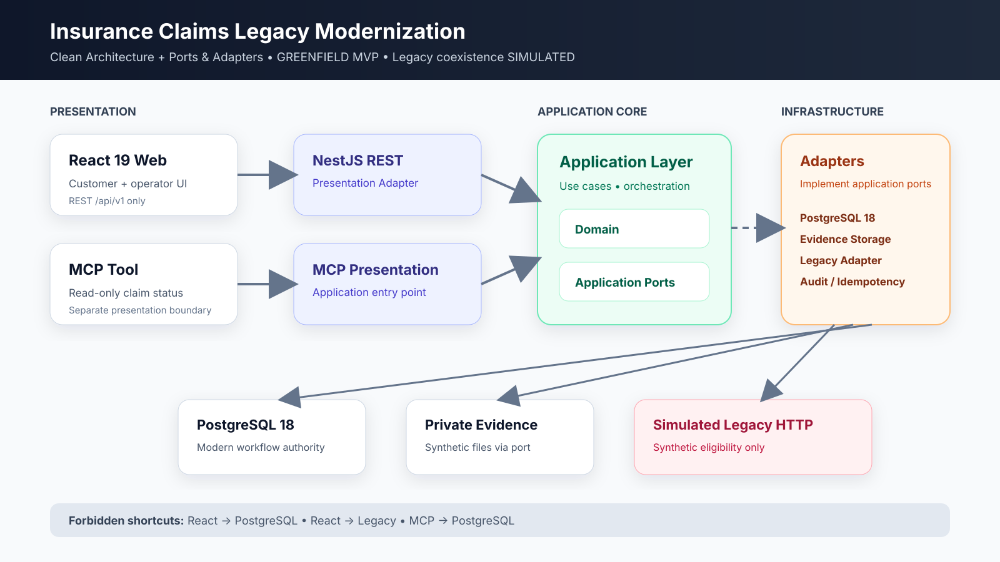
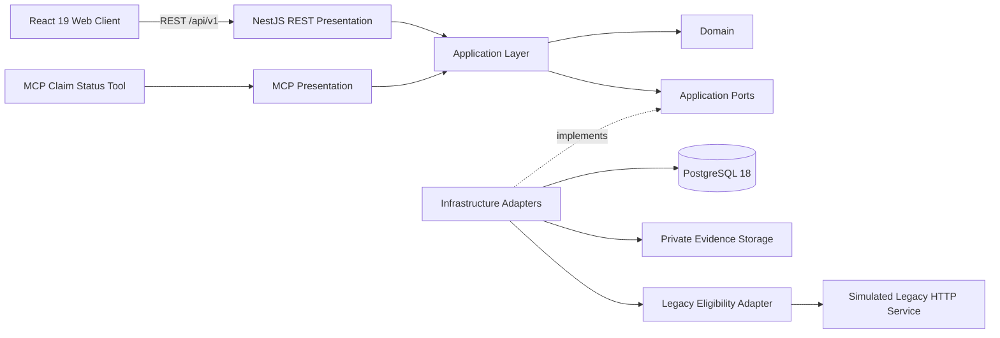

# Insurance Claims Legacy Modernization

**Portfolio modernization case study showing how an insurance-claims workflow can evolve incrementally while keeping the modern product decoupled from a simulated legacy dependency.**

[](https://github.com/LuisHdezE/InsuranceClaims/actions/workflows/api-qa.yml)
[](https://github.com/LuisHdezE/InsuranceClaims/actions/workflows/integration-qa-web.yml)
[](https://github.com/LuisHdezE/InsuranceClaims/actions/workflows/operations-observability.yml)
[](https://github.com/LuisHdezE/InsuranceClaims/actions/workflows/openapi-validation.yml)

> **Case-study disclaimer**  
> This is an unofficial technical case study inspired by publicly observable insurance workflows. There is no affiliation with FAR Seguros. All policy, claim, operator and operational data are synthetic/demo data. Legacy coexistence is **SIMULATED**.

## At a glance

| | |
|---|---|
| **Current release** | **v0.2.0 — Claims Operations Experience** |
| **Historical MVP baseline** | **v0.1.0** |
| **Delivery model** | GREENFIELD modernization with simulated legacy coexistence |
| **Blueprint consumer baseline** | Software Development Blueprint **0.5.2** |
| **Architecture** | Clean Architecture + Ports & Adapters |
| **Backend** | Node.js 24, NestJS 12, TypeScript |
| **Frontend** | React 19, Vite 7, TypeScript |
| **Persistence** | PostgreSQL 18, authoritative for the modern claims workflow |
| **Contracts** | REST `/api/v1`, OpenAPI 3.1, Postman, separate read-only MCP boundary |
| **Effective API revision** | `api-v1-r2` — **15 operations** = 10 immutable base + 5 additive |
| **Historical MVP web slices** | **3 / 3 accepted** |
| **Claims Operations review** | Chrome 152, desktop/mobile, **12 committed screenshots** |
| **Published release** | [`v0.2.0`](https://github.com/LuisHdezE/InsuranceClaims/releases/tag/v0.2.0) |

## What the project demonstrates

The repository deliberately shows **evolution**, not a frozen demo.

### v0.1.0 — governed modernization MVP

The historical MVP established three accepted user-facing journeys:

1. **Digital Claim Intake**  
   Policy/vehicle verification, claim creation, evidence submission, idempotency, validation and resilient error handling.

2. **Customer Claim Tracking**  
   Proof-bound claim lookup with a customer-safe projection, invalid-proof handling and degraded/offline transport states.

3. **Claims Backoffice**  
   Operator authentication, claim listing/detail, protected evidence download, lifecycle transitions, authorization and stale-state concurrency protection.

That baseline completed the governed lifecycle through Release Gate and Operations, and its accepted evidence remains preserved rather than rewritten by later increments.

### v0.2.0 — Claims Operations Experience

The post-MVP increment adds an operator-focused experience on top of the historical baseline:

- operations Dashboard;
- Claims Workspace with an operational Kanban projection;
- Claim Operations Detail;
- Tasks Workspace;
- real `ClaimTask` lifecycle;
- Claim Timeline read projection;
- Evidence Attention projection;
- customer-safe Public Tracking continuity;
- responsive Claim Detail and mobile disclosure continuity.

A core business invariant is intentionally preserved:

> Completing a ClaimTask does **not** change Claim status automatically. Claim lifecycle mutation remains explicit and server-authoritative.

The curated review proved the separation:

- open tasks: `2 → 1`;
- pending evidence attention: `1 → 0`;
- Claim status after completing `EVIDENCE_REVIEW`: `RECEIVED`;
- Claim status after an explicit lifecycle transition: `UNDER_REVIEW`;
- customer-safe Public Tracking after that transition: `UNDER_REVIEW`.

## Product walkthrough

### Historical MVP surfaces

<table>
  <tr>
    <td width="50%"><strong>Digital claim intake</strong><br></td>
    <td width="50%"><strong>Customer claim tracking</strong><br></td>
  </tr>
  <tr>
    <td width="50%"><strong>Claims backoffice</strong><br></td>
    <td width="50%"><strong>Claim detail & lifecycle</strong><br></td>
  </tr>
</table>

### Claims Operations Experience

<table>
  <tr>
    <td width="50%"><strong>Operations dashboard</strong><br></td>
    <td width="50%"><strong>Claims workspace</strong><br></td>
  </tr>
  <tr>
    <td width="50%"><strong>Claim operations detail</strong><br></td>
    <td width="50%"><strong>Tasks workspace</strong><br></td>
  </tr>
</table>

The increment review includes desktop and mobile evidence, including `390×844`, under [`documentation/claims-operations/review/generated/assets`](documentation/claims-operations/review/generated/assets).

## Architecture

<p align="center">
  
</p>



### Boundary rules

```text
REST -> Application -> Ports -> Infrastructure
MCP  -> Application -> Ports -> Infrastructure
React -> REST API
Legacy Adapter -> Legacy Port
```

The following shortcuts are intentionally forbidden:

```text
React -X-> PostgreSQL
React -X-> Legacy
MCP   -X-> PostgreSQL
```

PostgreSQL is authoritative for the modern claims workflow. The simulated legacy service is authoritative only for its synthetic policy/vehicle eligibility dataset.

For the full rationale and conformance evidence, see [`documentation/architecture/ARCHITECTURE.md`](documentation/architecture/ARCHITECTURE.md) and [`documentation/architecture/ARCHITECTURE_IMPLEMENTATION_CONFORMANCE.md`](documentation/architecture/ARCHITECTURE_IMPLEMENTATION_CONFORMANCE.md).

## API evolution

### Immutable base: `api-v1-r1`

The historical base contributes **10 operations**, including the original business surface plus operational routes. Its accepted contract remains byte-for-byte immutable.

Core business operations include:

| Operation ID | Purpose |
|---|---|
| `verifyPolicyVehicle` | Verify synthetic policy/vehicle eligibility through the legacy adapter |
| `createClaim` | Create a modern claim with idempotency protection |
| `trackClaim` | Return a proof-bound customer-safe claim projection |
| `authenticateOperator` | Authenticate a backoffice operator |
| `listClaims` | List authorized backoffice claims |
| `getClaimDetail` | Retrieve protected claim detail |
| `downloadClaimEvidence` | Download protected synthetic evidence |
| `transitionClaimStatus` | Transition claim lifecycle with concurrency protection |

### Additive revision: `api-v1-r2`

`api-v1-r2` composes the immutable r1 base with five governed operator additions:

| Operation ID | Method | Path |
|---|---|---|
| `listTasks` | GET | `/api/v1/operator/tasks` |
| `listClaimTasks` | GET | `/api/v1/operator/claims/{claimId}/tasks` |
| `completeClaimTask` | POST | `/api/v1/operator/tasks/{taskId}/complete` |
| `getClaimTimeline` | GET | `/api/v1/operator/claims/{claimId}/timeline` |
| `getClaimEvidenceAttention` | GET | `/api/v1/operator/claims/{claimId}/evidence-attention` |

The effective r2 surface is therefore **15 operations: 10 base + 5 additive**. The change is governed by `API-IMPACT-001` as `platform_cross_cutting`, with platform revalidation and preservation of unrelated accepted `0.1.0` evidence.

- Base OpenAPI: [`openapi.yaml`](openapi.yaml)
- Post-MVP revision: [`documentation/api/post-mvp/API_CONTRACT_REVISION_R2.json`](documentation/api/post-mvp/API_CONTRACT_REVISION_R2.json)
- r2 additions: [`documentation/api/post-mvp/API_ENDPOINT_INVENTORY_R2_ADDITIONS.json`](documentation/api/post-mvp/API_ENDPOINT_INVENTORY_R2_ADDITIONS.json)
- Postman: [`postman/`](postman/)

## Security and reliability highlights

- short-lived JWT operator authentication;
- API-side RBAC and permission enforcement;
- Argon2id operator password hashing;
- idempotent claim creation using `Idempotency-Key`;
- optimistic concurrency guards for Claim and ClaimTask transitions;
- RFC 9457 Problem Details;
- request correlation and durable audit correlation;
- safe error sanitization and secret non-leakage assertions;
- protected evidence download and private evidence storage port;
- rate limiting;
- PostgreSQL backup/restore proof with `pg_dump` and `pg_restore`;
- liveness/readiness endpoints and executable observability checks.

The complete threat/security model lives in [`documentation/security/SECURITY_THREAT_MODEL.md`](documentation/security/SECURITY_THREAT_MODEL.md).

## Verification evidence

Validation is intentionally broader than unit tests. The repository contains automation and committed evidence for:

- Domain/Application/API tests;
- executable architecture boundary checks;
- OpenAPI and Postman contract validation;
- real PostgreSQL runtime API QA;
- real Chrome functional journeys;
- API transport fidelity;
- authorization and security behavior;
- responsive and accessibility behavior;
- degraded/offline states;
- idempotency and concurrency behavior;
- `pg_dump` / `pg_restore` recoverability;
- request/audit correlation and secret non-leakage observability checks;
- fresh Claims Operations increment review with **12 screenshots**.

The v0.2.0 curated review used PostgreSQL 18, the simulated legacy service, the real API, the real React client and Chrome 152.

See:

- [`documentation/claims-operations/CLAIMS_OPERATIONS_INCREMENT_REVIEW.md`](documentation/claims-operations/CLAIMS_OPERATIONS_INCREMENT_REVIEW.md)
- [`documentation/claims-operations/review/generated/claims-operations-increment-review.json`](documentation/claims-operations/review/generated/claims-operations-increment-review.json)
- [`documentation/integration-qa/`](documentation/integration-qa/)
- [`documentation/operations/`](documentation/operations/)

## Blueprint journey

This repository is a worked consumer of **Software Development Blueprint 0.5.2**.

The historical v0.1.0 MVP traversed the complete governed lifecycle:

```text
Discovery
  -> Target Definition
  -> Requirements & Domain
  -> Interface Scope Baseline
  -> Architecture / Security / Data
  -> API Contract Design
  -> API Implementation
  -> OpenAPI Validation
  -> Postman Contract
  -> API QA
  -> API Gate
  -> Interface Inventory
  -> Visual Identity
  -> Design System
  -> Client Architecture
  -> Functional Interface Slices
  -> Visual & Functional Review
  -> Integration QA
  -> Human Acceptance
  -> Release Gate
  -> Operations & Maintenance
```

The v0.2.0 Claims Operations increment was governed as post-MVP evolution. It preserved frozen v0.1.0 evidence, introduced `api-v1-r2`, captured fresh browser evidence, required human review, and was formalized and published through separate human-controlled merge and publication gates.

## Repository map

```text
apps/
  api/                  NestJS REST presentation
  mcp/                  Separate MCP presentation
  legacy-simulator/     Synthetic legacy HTTP dependency
  web/                  React client

packages/
  domain/               Domain model
  application/          Use cases and ports
  infrastructure/       PostgreSQL, evidence and legacy adapters

prisma/                 Persistence contract/tooling
documentation/          Architecture, security, QA, reviews and release evidence
postman/                REST collection and safe local environment
qa/                     Runtime, browser, backup/restore and observability QA
scripts/                Architecture and Blueprint validation scripts
.blueprint/             Blueprint consumer state and governed change artifacts
```

## Local verification

### Requirements

- Node.js **24.x**
- PostgreSQL **18** for real persistence/runtime QA
- npm with lockfile installation

### Install and verify

```bash
npm ci
npm run contract:emit
npm run typecheck
npm test
npm run architecture:check
npm --workspace @insurance/web test
npm --workspace @insurance/web run build
npm audit --omit=dev --audit-level=high
```

### Run the local composition

Copy `.env.example` to a local environment file and replace demo secrets locally. Never commit real credentials.

With PostgreSQL prepared, run the services in separate terminals:

```bash
npm run start:legacy
npm run start:api
npm run start:mcp
npm --workspace @insurance/web run dev
```

Default ports from `.env.example` are API `3000`, MCP `3100` and legacy simulator `3200`. Vite uses its configured development port.

## Intentional limitations

This repository is a **portfolio modernization technical case study**, not a production deployment for FAR Seguros or any insurer.

It does **not** claim:

- FAR production infrastructure or private internal processes;
- real insurer/customer data;
- production monitoring or on-call topology;
- production SLO/SLA or alert thresholds;
- production HA, replication, autoscaling or disaster-recovery topology;
- production backup schedules, RPO or RTO;
- production object storage or regulatory retention policy.

All business data are synthetic/demo data, and legacy coexistence is simulated by design.

## Portfolio & release artifacts

- [Technical case study](documentation/portfolio/CASE_STUDY.md)
- [Historical MVP v0.1.0 release notes](documentation/portfolio/RELEASE_NOTES_v0.1.0.md)
- [Claims Operations v0.2.0 release notes](documentation/portfolio/RELEASE_NOTES_v0.2.0.md)
- [Claims Operations release formalization](documentation/release/CLAIMS_OPERATIONS_RELEASE_0.2.0.md)
- [Architecture overview graphic](documentation/portfolio/architecture-overview.svg)
- [Published GitHub Release v0.2.0](https://github.com/LuisHdezE/InsuranceClaims/releases/tag/v0.2.0)

## Release record

`v0.2.0` is the current published release.

- annotated tag: `v0.2.0`;
- release commit: `9265417849f398f5d1efa56b7cd8ff365b950dbb`;
- tag object: `1a946e7fc4a20d20b97876826e6a699ec8412f28`;
- GitHub Release ID: `384441015`;
- published at: `2026-09-08T04:09:58Z`;
- draft: `false`;
- prerelease: `false`.

The tag is the immutable release pointer for `0.2.0`. Later documentation changes on `main` do not move or recreate that tag.
