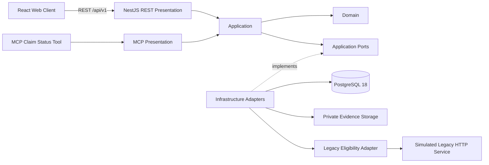

# Insurance Claims Legacy Modernization

**A governed modernization case study that turns a legacy-dependent insurance claims workflow into a modern, role-aware, testable product without coupling the new platform to the legacy system.**

[](https://github.com/LuisHdezE/InsuranceClaims/actions/workflows/api-qa.yml)
[](https://github.com/LuisHdezE/InsuranceClaims/actions/workflows/integration-qa-web.yml)
[](https://github.com/LuisHdezE/InsuranceClaims/actions/workflows/r3-final-closure.yml)
[](https://github.com/LuisHdezE/InsuranceClaims/actions/workflows/r3-full-product-technical-closure.yml)

> **Portfolio case-study disclaimer**  
> This is an unofficial technical case study with no affiliation with FAR Seguros. All policy, claim, operator and operational data are synthetic/demo data. Delivery mode is **GREENFIELD** and legacy coexistence is **SIMULATED**.

## Why this project matters

Legacy modernization is rarely just a UI rewrite. The hard part is introducing better customer and operator experiences while keeping business rules, security, persistence and legacy integration under explicit boundaries.

This project demonstrates that transition as an end-to-end product: public claim intake and tracking, staff operations, customer and policy 360, renewals, collections, analytics, governed administration, async processing and recovery, all backed by executable architecture and QA evidence.

## At a glance

| | |
|---|---|
| **Current product state** | **R3 — Full Product Technical Closure completed** |
| **Latest published release** | **v0.2.0 — Claims Operations Experience** |
| **Next planned release** | **v0.3.0 — pending separate release formalization** |
| **API revision** | `api-v1-r3` |
| **REST surface** | **90 operations · 76 paths · 16 families** |
| **Productized web surfaces** | **22** |
| **Backend test baseline** | **91 tests** |
| **Architecture** | Clean Architecture + Ports & Adapters |
| **Backend** | Node.js 24 · NestJS 12 · TypeScript |
| **Frontend** | React 19 · Vite 7 · TypeScript |
| **Persistence** | PostgreSQL 18 |
| **Contracts** | REST `/api/v1` · OpenAPI 3.1 · Postman · separate read-only MCP boundary |
| **Blueprint consumer** | Software Development Blueprint **0.5.2** |
| **Legacy coexistence** | **SIMULATED** behind an adapter boundary |

## Release candidate scope

The historical MVP Release Gate remains preserved as accepted evidence. R3 does not rewrite that decision: it is a later governed product evolution whose technical closure is recorded separately. The latest published release is still `v0.2.0`; `v0.3.0` remains pending its own formalization and publication gates.

## Product experience

<table>
  <tr>
    <td width="50%"><strong>Claims workspace</strong><br></td>
    <td width="50%"><strong>Claim detail</strong><br></td>
  </tr>
</table>

R3 productization covers:

- public claim intake and public tracking;
- operator login and role-aware Staff Workspace;
- operations dashboard, Claims Workspace, Claim Detail and Tasks;
- customer directory and Customer 360;
- policy directory and Policy 360;
- renewals and collections;
- analytics;
- pipeline, automation, communication-template, custom-field and guidance administration;
- governed imports;
- recovery operations and dead-letter handling.

The final presentation reconciliation keeps visible product language consistent in Spanish while preserving literal contract vocabulary where it carries technical meaning.

## Modernization architecture

<p align="center">
  
</p>



The essential rule is directional:

```text
Presentation -> Application -> Ports <- Infrastructure
```

The modern product never reaches PostgreSQL or the simulated legacy service directly from the React client. Legacy concerns stay localized behind the adapter boundary, making future replacement or evolution a boundary problem instead of a product-wide rewrite.

## R3 capability evolution

R3 expands the governed API to **90 effective REST operations across 76 paths and 16 operation families**. The revision contains 15 inherited operations, 75 new operations and 7 changed existing operations, with deterministic runtime reconciliation at 90/90.

The platform now spans claims operations plus staff identity/RBAC, operational projections and metrics, pipelines, customer/policy 360, communication foundations, integration events, automation, async workers, dead-letter recovery, guidance, governed imports, renewals, collections, custom fields and bulk-action API capability.

OpenAPI and Postman are generated/validated against the frozen R3 inventory. The historical read-only MCP `get_claim_status` tool remains a separate presentation contract and is intentionally excluded from REST counts.

## Security and reliability

The solution demonstrates:

- short-lived JWT authentication and API-side RBAC;
- server-authoritative permissions and role-aware navigation;
- Argon2id password hashing;
- idempotency and concurrency protection;
- RFC 9457 Problem Details;
- request and durable-audit correlation;
- safe error sanitization and secret non-leakage checks;
- protected evidence access through a storage port;
- rate limiting;
- PostgreSQL persistence/runtime QA;
- worker, integration-event and dead-letter recovery behavior;
- backup/restore and executable observability evidence.

## Verification, not screenshot theater

The repository contains executable evidence for:

- backend tests and architecture-boundary checks;
- real PostgreSQL 18 API QA;
- R3 runtime reconciliation at 90/90;
- OpenAPI zero drift;
- Postman semantic coverage at 90/90;
- browser integration journeys;
- responsive/accessibility checks;
- degraded/offline behavior;
- authentication, authorization, idempotency, concurrency and rate limiting;
- async/recovery flows;
- production web build and strict typecheck;
- full-product technical closure on the exact approved head.

R3 was closed technically through PR #90. The accepted merge commit is `54f791707d6a4e2f9425f57d0a18e20e139fb518`.

## Deliberate product boundaries

Three capabilities are intentionally not productized as standalone R3 UI surfaces:

1. **Authenticated Customer Portal UI** — public R3 productization remains claim intake plus claim tracking.
2. **Operator Communications UI** — sending requires a template-version contract and permissions that Claims Operator/Supervisor do not hold; no manual UUID or privilege bypass was invented.
3. **Standalone Bulk Actions UI** — API capability exists for Claims Supervisor but is not exposed as an independent R3 view.

These are explicit product decisions, not hidden gaps.

## Release history

- **v0.1.0** — governed modernization MVP.
- **v0.2.0** — Claims Operations Experience, published and immutable.
- **R3** — full product technically closed; release formalization to **v0.3.0** is intentionally a separate human-governed task.

The repository does not move or rewrite historical tags to make newer work appear released retroactively.

## Release documentation and evidence

- [R3 Technical Case Study](documentation/portfolio/CASE_STUDY.md)
- [R3 Portfolio Hardening record](documentation/portfolio/R3_PORTFOLIO_HARDENING.md)
- [Full Product Technical Closure](documentation/product-closure/r3/FULL_PRODUCT_TECHNICAL_CLOSURE_R3.md)
- [R3 API Final Closure](documentation/api-implementation/r3/FINAL_CLOSURE_INCREMENT_22.md)
- [R3 UI reference index](documentation/ui-reference/r3/README.md)
- [Architecture](documentation/architecture/ARCHITECTURE.md)
- [Security threat model](documentation/security/SECURITY_THREAT_MODEL.md)
- [Published v0.2.0 release](https://github.com/LuisHdezE/InsuranceClaims/releases/tag/v0.2.0)

## Local verification

### Requirements

- Node.js **24.x**
- PostgreSQL **18** for real persistence/runtime QA
- npm with lockfile installation

### Install and verify

```bash
npm ci
npm run contract:emit
npm run typecheck
npm test
npm run architecture:check
npm run api:reconcile:r3
npm run openapi:check:r3
npm run postman:check:r3
npm run r3:closure:validate
npm run r3:product-closure:validate
npm run typecheck --workspace=@insurance/web
npm test --workspace=@insurance/web
npm run build --workspace=@insurance/web
```

---

**Modernize the experience without surrendering the architecture.**
