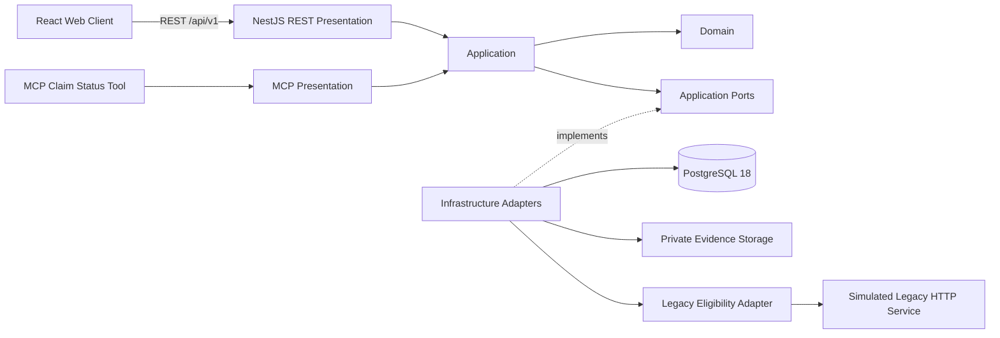

# Insurance Claims Legacy Modernization

**Portfolio modernization case study showing how an insurance-claims workflow can evolve incrementally while keeping the modern product decoupled from a simulated legacy dependency.**

[](https://github.com/LuisHdezE/InsuranceClaims/actions/workflows/api-qa.yml)
[](https://github.com/LuisHdezE/InsuranceClaims/actions/workflows/integration-qa-web.yml)
[](https://github.com/LuisHdezE/InsuranceClaims/actions/workflows/operations-observability.yml)
[](https://github.com/LuisHdezE/InsuranceClaims/actions/workflows/openapi-validation.yml)

> **Case-study disclaimer**  
> This is an unofficial technical case study inspired by publicly observable insurance workflows. There is no affiliation with FAR Seguros. All policy, claim, operator and operational data are synthetic/demo data. Legacy coexistence is **SIMULATED**.

## At a glance

| | |
|---|---|
| **Current release** | **v0.2.0 — Claims Operations Experience** |
| **Historical MVP baseline** | **v0.1.0** |
| **Delivery model** | GREENFIELD modernization with simulated legacy coexistence |
| **Blueprint consumer baseline** | Software Development Blueprint **0.5.2** |
| **Architecture** | Clean Architecture + Ports & Adapters |
| **Backend** | Node.js 24 · NestJS 12 · TypeScript |
| **Frontend** | React 19 · Vite 7 · TypeScript |
| **Persistence** | PostgreSQL 18, authoritative for the modern claims workflow |
| **Contracts** | REST `/api/v1` · OpenAPI 3.1 · Postman · separate read-only MCP boundary |
| **Effective API revision** | `api-v1-r2` — **15 operations** = 10 immutable base + 5 additive |
| **Historical MVP web slices** | **3 / 3 accepted** |
| **Claims Operations review** | Chrome 152 · desktop/mobile · **12 committed screenshots** |
| **Published release** | [`v0.2.0`](https://github.com/LuisHdezE/InsuranceClaims/releases/tag/v0.2.0) |

## Release evolution

### v0.1.0 — governed modernization MVP

The historical MVP established three accepted user journeys:

1. **Digital Claim Intake** — policy/vehicle verification, claim creation, evidence submission, idempotency and validation.
2. **Customer Claim Tracking** — proof-bound, customer-safe claim status projection with degraded/offline handling.
3. **Claims Backoffice** — operator authentication, claim list/detail, evidence download, lifecycle transitions, RBAC and concurrency protection.

That baseline completed the governed lifecycle through Release Gate and Operations. Its accepted evidence remains preserved instead of being rewritten by later increments.

### v0.2.0 — Claims Operations Experience

The post-MVP increment adds:

- operations Dashboard;
- Claims Workspace with an operational Kanban projection;
- Claim Operations Detail;
- Tasks Workspace;
- real `ClaimTask` lifecycle;
- Claim Timeline read projection;
- Evidence Attention projection;
- customer-safe Public Tracking continuity;
- responsive Claim Detail and mobile disclosure continuity.

A core invariant is intentionally preserved:

> Completing a ClaimTask does **not** change Claim status automatically. Claim lifecycle mutation remains explicit and server-authoritative.

The curated review proved:

- open tasks: `2 → 1`;
- pending evidence attention: `1 → 0`;
- Claim status after completing `EVIDENCE_REVIEW`: `RECEIVED`;
- Claim status after explicit lifecycle transition: `UNDER_REVIEW`;
- Public Tracking after that transition: `UNDER_REVIEW`.

## Product walkthrough

<table>
  <tr>
    <td width="50%"><strong>Operations dashboard</strong><br></td>
    <td width="50%"><strong>Claims workspace</strong><br></td>
  </tr>
  <tr>
    <td width="50%"><strong>Claim operations detail</strong><br></td>
    <td width="50%"><strong>Tasks workspace</strong><br></td>
  </tr>
</table>

The increment review includes desktop/mobile evidence, including `390×844`, under [`documentation/claims-operations/review/generated/assets`](documentation/claims-operations/review/generated/assets). Historical v0.1.0 visual evidence remains under [`documentation/visual-functional-review/generated/assets`](documentation/visual-functional-review/generated/assets).

## Architecture

<p align="center">
  
</p>



Dependency direction:

```text
REST -> Application -> Ports -> Infrastructure
MCP  -> Application -> Ports -> Infrastructure
React -> REST API
Legacy Adapter -> Legacy Port
```

Forbidden shortcuts:

```text
React -X-> PostgreSQL
React -X-> Legacy
MCP   -X-> PostgreSQL
```

PostgreSQL is authoritative for the modern claims workflow. The simulated legacy service is authoritative only for its synthetic policy/vehicle eligibility dataset.

See [`documentation/architecture/ARCHITECTURE.md`](documentation/architecture/ARCHITECTURE.md) and [`documentation/architecture/ARCHITECTURE_IMPLEMENTATION_CONFORMANCE.md`](documentation/architecture/ARCHITECTURE_IMPLEMENTATION_CONFORMANCE.md).

## API evolution

`api-v1-r2` preserves the immutable `api-v1-r1` contract and composes it with five additive operator operations.

### Immutable base — 10 operations

Core business operations include:

| Operation ID | Purpose |
|---|---|
| `verifyPolicyVehicle` | Verify synthetic policy/vehicle eligibility through the legacy adapter |
| `createClaim` | Create a modern claim with idempotency protection |
| `trackClaim` | Return a proof-bound customer-safe claim projection |
| `authenticateOperator` | Authenticate a backoffice operator |
| `listClaims` | List authorized backoffice claims |
| `getClaimDetail` | Retrieve protected claim detail |
| `downloadClaimEvidence` | Download protected synthetic evidence |
| `transitionClaimStatus` | Transition Claim lifecycle with concurrency protection |

The base contract also contains operational routes, producing 10 total r1 operations.

### r2 additions — 5 operations

| Operation ID | Method | Path |
|---|---|---|
| `listTasks` | GET | `/api/v1/operator/tasks` |
| `listClaimTasks` | GET | `/api/v1/operator/claims/{claimId}/tasks` |
| `completeClaimTask` | POST | `/api/v1/operator/tasks/{taskId}/complete` |
| `getClaimTimeline` | GET | `/api/v1/operator/claims/{claimId}/timeline` |
| `getClaimEvidenceAttention` | GET | `/api/v1/operator/claims/{claimId}/evidence-attention` |

Effective r2 surface: **15 operations = 10 base + 5 additive**.

The change is governed by `API-IMPACT-001` as `platform_cross_cutting`, with platform revalidation and preservation of unrelated accepted `0.1.0` evidence.

- Base OpenAPI: [`openapi.yaml`](openapi.yaml)
- Revision r2: [`documentation/api/post-mvp/API_CONTRACT_REVISION_R2.json`](documentation/api/post-mvp/API_CONTRACT_REVISION_R2.json)
- r2 additions: [`documentation/api/post-mvp/API_ENDPOINT_INVENTORY_R2_ADDITIONS.json`](documentation/api/post-mvp/API_ENDPOINT_INVENTORY_R2_ADDITIONS.json)
- Postman: [`postman/`](postman/)

## Security and reliability

- short-lived JWT operator authentication;
- API-side RBAC and permission enforcement;
- Argon2id password hashing;
- idempotent claim creation using `Idempotency-Key`;
- optimistic concurrency guards for Claim and ClaimTask transitions;
- RFC 9457 Problem Details;
- request/audit correlation;
- safe error sanitization and secret non-leakage assertions;
- protected evidence download behind a storage port;
- rate limiting;
- PostgreSQL backup/restore proof with `pg_dump` and `pg_restore`;
- liveness/readiness and executable observability checks.

See [`documentation/security/SECURITY_THREAT_MODEL.md`](documentation/security/SECURITY_THREAT_MODEL.md).

## Verification evidence

The repository contains automation and committed evidence for:

- Domain/Application/API tests;
- architecture boundary checks;
- OpenAPI and Postman validation;
- real PostgreSQL runtime API QA;
- real Chrome functional journeys;
- authorization/security behavior;
- responsive/accessibility behavior;
- degraded/offline states;
- idempotency/concurrency behavior;
- `pg_dump` / `pg_restore` recoverability;
- request/audit correlation and secret non-leakage observability;
- fresh Claims Operations review with **12 screenshots**.

The v0.2.0 curated review used PostgreSQL 18, simulated legacy coexistence, the real API, the real React client and Chrome 152.

Evidence:

- [`documentation/claims-operations/CLAIMS_OPERATIONS_INCREMENT_REVIEW.md`](documentation/claims-operations/CLAIMS_OPERATIONS_INCREMENT_REVIEW.md)
- [`documentation/claims-operations/review/generated/claims-operations-increment-review.json`](documentation/claims-operations/review/generated/claims-operations-increment-review.json)
- [`documentation/integration-qa/`](documentation/integration-qa/)
- [`documentation/operations/`](documentation/operations/)

## Blueprint journey

This repository is a worked consumer of **Software Development Blueprint 0.5.2**.

The historical v0.1.0 MVP traversed the complete governed lifecycle:

```text
Discovery
  -> Target Definition
  -> Requirements & Domain
  -> Interface Scope Baseline
  -> Architecture / Security / Data
  -> API Contract Design
  -> API Implementation
  -> OpenAPI Validation
  -> Postman Contract
  -> API QA
  -> API Gate
  -> Interface Inventory
  -> Visual Identity
  -> Design System
  -> Client Architecture
  -> Functional Interface Slices
  -> Visual & Functional Review
  -> Integration QA
  -> Human Acceptance
  -> Release Gate
  -> Operations & Maintenance
```

The v0.2.0 Claims Operations increment was governed as post-MVP evolution. It preserved frozen v0.1.0 evidence, introduced `api-v1-r2`, captured fresh browser evidence, required human review, and was formalized and published through separate human-controlled merge and publication gates.

## Local verification

### Requirements

- Node.js **24.x**
- PostgreSQL **18** for real persistence/runtime QA
- npm with lockfile installation

### Install and verify

```bash
npm ci
npm run contract:emit
npm run typecheck
npm test
npm run architecture:check
npm --workspace @insurance/web test
npm --workspace @insurance/web run build
npm audit --omit=dev --audit-level=high
```

### Run locally

Copy `.env.example` to a local environment file and replace demo secrets locally. Never commit real credentials.

```bash
npm run start:legacy
npm run start:api
npm run start:mcp
npm --workspace @insurance/web run dev
```

Default ports from `.env.example`: API `3000`, MCP `3100`, legacy simulator `3200`.

## Historical Release candidate scope

The original **Release candidate scope** belonged to the governed v0.1.0 MVP. It covered the three accepted web slices and the supporting platform that subsequently received explicit human Release Gate approval and completed the Operations lifecycle.

That historical candidate evidence remains frozen. The published `v0.2.0` release is not being reclassified as a candidate by preserving this marker.

## Release documentation

Historical v0.1.0 readiness, release-gate and Operations evidence remain available under [`documentation/release/`](documentation/release/) and [`documentation/operations/`](documentation/operations/).

Current v0.2.0 publication artifacts:

- [Historical MVP v0.1.0 release notes](documentation/portfolio/RELEASE_NOTES_v0.1.0.md)
- [Claims Operations v0.2.0 release notes](documentation/portfolio/RELEASE_NOTES_v0.2.0.md)
- [Claims Operations release formalization](documentation/release/CLAIMS_OPERATIONS_RELEASE_0.2.0.md)
- [Published GitHub Release v0.2.0](https://github.com/LuisHdezE/InsuranceClaims/releases/tag/v0.2.0)

## Intentional limitations

This repository is a **portfolio modernization technical case study**, not a production deployment for FAR Seguros or any insurer.

It does **not** claim:

- FAR production infrastructure or private internal processes;
- real insurer/customer data;
- production monitoring or on-call topology;
- production SLO/SLA or alert thresholds;
- production HA, replication, autoscaling or disaster-recovery topology;
- production backup schedules, RPO or RTO;
- production object storage or regulatory retention policy.

All business data are synthetic/demo data, and legacy coexistence is simulated by design.

## Release record

`v0.2.0` is the current published release.

- annotated tag: `v0.2.0`;
- release commit: `9265417849f398f5d1efa56b7cd8ff365b950dbb`;
- tag object: `1a946e7fc4a20d20b97876826e6a699ec8412f28`;
- GitHub Release ID: `384441015`;
- published at: `2026-09-08T04:09:58Z`;
- draft: `false`;
- prerelease: `false`.

The tag is the immutable release pointer for `0.2.0`. Later documentation changes on `main` do not move or recreate that tag.
