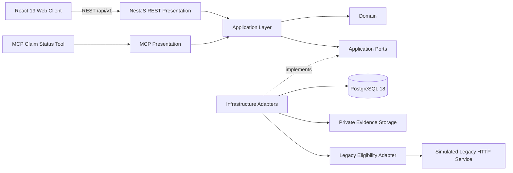

# Insurance Claims Legacy Modernization — Technical Case Study

## Executive summary

Insurance Claims Legacy Modernization is a portfolio MVP that demonstrates how a claims experience can be modernized incrementally while insulating the new application from a legacy dependency.

The implementation is deliberately GREENFIELD, with legacy coexistence **SIMULATED**. It is an unofficial technical case study with no affiliation with FAR Seguros. All policy, claim, operator and operational data are synthetic/demo data.

The project completed the Software Development Blueprint 0.5.2 lifecycle, including three accepted web slices, Integration QA, Human Acceptance, Release Gate `PASS`, and Operations `COMPLETE / 100%` with executable observability evidence.

## The modernization problem

A legacy-dependent claims workflow creates a useful modernization challenge: introduce a modern customer and operator experience without allowing the frontend, domain model or modern persistence layer to become structurally coupled to the legacy system.

The MVP therefore treats modernization as a boundary-design problem, not merely a UI rewrite.

### Core engineering goals

- expose modern claim intake, tracking and backoffice experiences;
- keep PostgreSQL authoritative for the modern claims workflow;
- isolate legacy eligibility behind an application port and infrastructure adapter;
- keep MCP as a separate read-only presentation boundary;
- enforce Clean Architecture + Ports & Adapters across API, frontend, MCP and legacy integration;
- prove behavior with executable QA rather than portfolio-only screenshots;
- preserve explicit synthetic/demo and simulated-legacy boundaries.

## Solution architecture



The critical architectural rule is directional:

```text
Presentation -> Application -> Ports -> Infrastructure
```

The web client talks to REST. MCP talks to the Application layer through its own presentation boundary. Infrastructure implements the application ports. The simulated legacy service is reached only through the legacy adapter.

Forbidden shortcuts include:

```text
React -X-> PostgreSQL
React -X-> Legacy
MCP   -X-> PostgreSQL
```

This keeps legacy replacement or evolution localized to the adapter boundary rather than spreading legacy assumptions through the product.

## Functional scope

### 1. Digital Claim Intake

The customer can verify synthetic policy/vehicle eligibility, create a claim and submit evidence. The flow includes validation, idempotency and resilient error behavior.

### 2. Customer Claim Tracking

The customer can retrieve a proof-bound, customer-safe projection of claim status. The interface also covers invalid-proof and degraded/offline states.

### 3. Claims Backoffice

Authorized operators can authenticate, list claims, inspect claim detail, download protected evidence and transition the claim lifecycle. State transitions include authorization and stale-state concurrency protection.

## Contract surface

The REST API exposes eight business operations:

| Operation | Responsibility |
|---|---|
| `verifyPolicyVehicle` | Verify synthetic policy/vehicle eligibility through the legacy adapter |
| `createClaim` | Create a modern claim with idempotency protection |
| `trackClaim` | Return a proof-bound customer-safe projection |
| `authenticateOperator` | Authenticate a backoffice operator |
| `listClaims` | List authorized claims |
| `getClaimDetail` | Retrieve protected claim detail |
| `downloadClaimEvidence` | Download protected synthetic evidence |
| `transitionClaimStatus` | Transition claim lifecycle with concurrency protection |

Operational routes provide liveness and readiness. The MCP tool remains a separate read-only presentation contract rather than being disguised as another REST endpoint.

## Security and reliability design

The MVP includes:

- short-lived JWT operator authentication;
- API-side RBAC and permission enforcement;
- Argon2id password hashing;
- idempotent claim creation using `Idempotency-Key`;
- expected-state concurrency protection for lifecycle transitions;
- RFC 9457 Problem Details;
- request and durable-audit correlation;
- safe error sanitization and secret non-leakage assertions;
- protected evidence download behind a private evidence-storage port;
- rate limiting;
- PostgreSQL backup/restore proof using `pg_dump` and `pg_restore`;
- liveness, readiness and executable observability checks.

## Delivery and governance

The project was developed as a governed consumer of Software Development Blueprint 0.5.2:

```text
Discovery
  -> Target Definition
  -> Requirements & Domain
  -> Interface Scope Baseline
  -> Architecture / Security / Data
  -> API Contract Design
  -> API Implementation
  -> OpenAPI Validation
  -> Postman Contract
  -> API QA
  -> API Gate
  -> Interface Inventory
  -> Visual Identity
  -> Design System
  -> Client Architecture
  -> Functional Interface Slices
  -> Visual & Functional Review
  -> Integration QA
  -> Human Acceptance
  -> Release Gate
  -> Operations & Maintenance
```

All three web slices reached `ACCEPTED`. Release Gate reached `PASS`. Operations reached `COMPLETE / 100%`.

Git/PR governance was kept separate from lifecycle approval. Human approval of a Blueprint gate did not implicitly authorize merging a pull request.

## Verification strategy

The repository demonstrates more than unit-level correctness. Its evidence includes:

- Domain/Application/API tests;
- executable architecture-boundary checks;
- OpenAPI validation;
- Postman contract validation;
- API QA against PostgreSQL;
- browser journeys in Chrome;
- API transport fidelity checks;
- authorization/security behavior;
- responsive and accessibility verification;
- degraded/offline behavior;
- idempotency and concurrency behavior;
- PostgreSQL backup/restore recoverability;
- request/audit correlation and secret non-leakage observability checks.

## Intentional limitations

This is a modernization MVP and technical case study, not a production insurer deployment.

It does not claim:

- FAR production infrastructure or internal processes;
- real insurer/customer data;
- production SLO/SLA or alert thresholds;
- production monitoring/on-call topology;
- production HA, replication or autoscaling;
- production disaster-recovery topology;
- production backup schedules, RPO or RTO;
- production regulatory retention policy.

Those boundaries are intentional. The project demonstrates architecture, delivery discipline and verifiable modernization mechanics without inventing unavailable production facts.

## Evidence map

- [Repository overview](../../README.md)
- [Architecture](../architecture/ARCHITECTURE.md)
- [Architecture implementation conformance](../architecture/ARCHITECTURE_IMPLEMENTATION_CONFORMANCE.md)
- [API contract](../api/API_CONTRACT.md)
- [Security threat model](../security/SECURITY_THREAT_MODEL.md)
- [Integration QA](../integration-qa/)
- [Release readiness](../release/RELEASE_READINESS.md)
- [Release Gate approval](../release/RELEASE_GATE_APPROVAL.md)
- [Operations observability evidence](../operations/OPERATIONS_OBSERVABILITY_EVIDENCE.md)
- [Visual & Functional Review assets](../visual-functional-review/generated/assets/)
- [Machine-readable Blueprint state](../../.blueprint/status.yaml)
