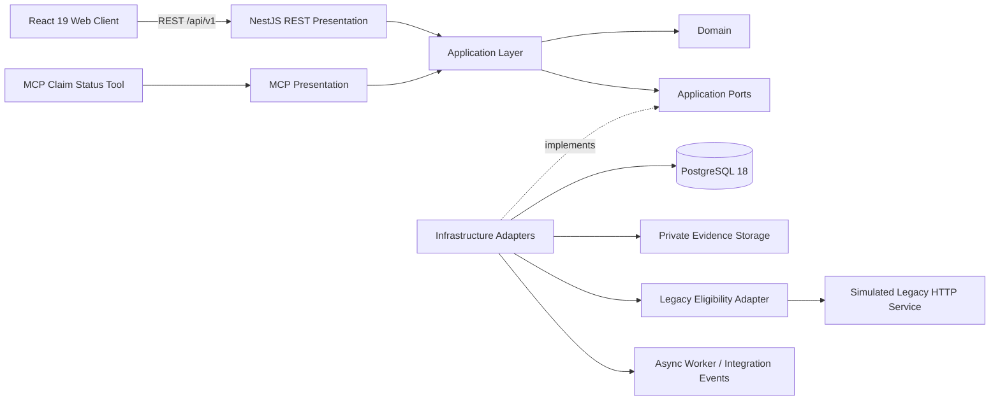

# Insurance Claims Legacy Modernization — R3 Technical Case Study

## Executive summary

Insurance Claims Legacy Modernization is a portfolio case study showing how an insurance claims workflow can evolve from a narrow modernization MVP into a broader operational platform while keeping the modern product decoupled from a simulated legacy dependency.

The implementation is deliberately **GREENFIELD** with legacy coexistence **SIMULATED**. It is an unofficial technical case study with no affiliation with FAR Seguros. All policy, claim, customer, staff and operational data are synthetic/demo data.

The current product state is **R3 Full Product Technical Closure**. R3 exposes **90 REST operations across 76 paths and 16 operation families**, productizes **22 web surfaces**, and preserves Clean Architecture + Ports & Adapters across API, web, MCP, persistence, workers and legacy integration.

The latest published GitHub release remains **v0.2.0**. R3 release formalization as `v0.3.0` is intentionally a separate human-governed step.

## The challenge

A legacy-dependent claims workflow creates two risks during modernization:

1. the new UI becomes a prettier shell around old coupling; or
2. a big-bang rewrite replaces one set of risks with another.

This project takes a third path: modernize incrementally around explicit boundaries.

The modern platform owns its claim workflow and persistence. Legacy eligibility remains isolated behind an application port and infrastructure adapter. Product interfaces consume authoritative application behavior rather than duplicating business decisions in the client.

## What the solution is designed to prove

- A modern claims experience can coexist with a legacy dependency without structural coupling.
- Clean Architecture can remain enforceable as product scope grows.
- API evolution can be governed and reconciled deterministically instead of drifting silently.
- Operator UX can become role-aware without making the frontend authoritative for permissions.
- Async automation and recovery can be introduced without creating a second domain model.
- Portfolio evidence can be executable, not merely screenshots and claims.

## Architecture



The dependency rule remains:

```text
Presentation -> Application -> Ports <- Infrastructure
```

Forbidden shortcuts include:

```text
React -X-> PostgreSQL
React -X-> Legacy
MCP   -X-> PostgreSQL
```

This matters because a future legacy replacement should primarily affect an adapter, not every layer of the product.

## Product experience

R3 is no longer only three MVP slices. The productized surface includes:

### Public experience

- Public Claim Intake
- Public Claim Tracking

### Claims operations

- Operator Login
- Staff Workspace
- Operations Dashboard
- Claims Workspace
- Claim Detail
- Tasks

### Customer and policy operations

- Customer Directory
- Customer 360
- Policy Directory
- Policy 360
- Renewals
- Collections

### Platform operations and administration

- Analytics
- Pipeline Administration
- Automation Administration
- Communication Template Administration
- Custom Field Administration
- Guidance Administration
- Governed Imports
- Recovery Operations / Dead Letters

The final R3 presentation reconciliation keeps visible user-facing language consistent in Spanish while preserving literal contract vocabulary such as enums, permission identifiers, `dry-run`, `commit` and `dead-letter` where translation would weaken technical meaning.

## API and contract evolution

R3 uses contract revision `api-v1-r3`:

| Metric | R3 |
|---|---:|
| Effective REST operations | **90** |
| Effective REST paths | **76** |
| Operation families | **16** |
| Inherited operations | **15** |
| New operations | **75** |
| Changed existing operations | **7** |
| Runtime reconciliation | **90/90** |
| Postman semantic coverage | **90/90** |

The historical MCP `get_claim_status` tool remains outside REST OpenAPI/Postman counting because it is a separate read-only presentation boundary.

R3 capability evolution includes ClaimTask lifecycle, staff identity and RBAC, claim pipeline projection, operational queries/metrics, pipeline administration, Customer/Policy 360, communication foundations, integration events, automation, async workers, dead-letter administration, insurer guidance, governed imports, renewals, collections, custom fields and bulk-action API capability.

## Security and server authority

The platform demonstrates:

- short-lived JWT operator authentication;
- API-side RBAC and permission enforcement;
- Argon2id password hashing;
- idempotency controls;
- optimistic/concurrency protection where required;
- RFC 9457 Problem Details;
- request/audit correlation;
- safe error sanitization and non-leakage checks;
- protected evidence access behind a storage port;
- rate limiting;
- route and presentation guards that do not silently elevate users.

The UI is role-aware, but the server remains authoritative. R3 explicitly protects against treating a Platform Admin visual shell, a route guard or a hidden button as a substitute for backend authorization.

## Data, async work and recovery

PostgreSQL 18 is authoritative for the modern claims workflow. The simulated legacy service is authoritative only for its synthetic eligibility dataset.

R3 also contains worker runtime, integration events, automation execution, dead-letter handling and recovery semantics. Those capabilities are validated through backend/API/integration evidence rather than through a separate parallel implementation.

## Verification strategy

The project deliberately avoids “screenshot theater”. Its evidence includes:

- backend test baseline of **91 tests**;
- architecture conformance checks;
- real PostgreSQL 18 runtime API QA;
- R3 runtime endpoint reconciliation at **90/90**;
- OpenAPI R3 zero drift;
- Postman R3 zero drift and **90/90** semantic coverage;
- browser journeys against the real API and React client;
- responsive/accessibility verification;
- degraded/offline behavior;
- auth/RBAC/security behavior;
- idempotency, concurrency and rate-limit behavior;
- durable audit/persistence invariants;
- async and dead-letter/recovery behavior;
- production builds and strict typechecks;
- exact-head full-product closure validation.

The final technical closure was merged through PR #90 as commit:

`54f791707d6a4e2f9425f57d0a18e20e139fb518`

## Delivery governance

The project is a worked consumer of Software Development Blueprint **0.5.2**. It started with the full governed MVP lifecycle and later evolved through explicit post-MVP increments and API impact analysis.

Important governance decisions include:

- human gate approval and Git merge approval are separate decisions;
- historical release evidence is preserved rather than rewritten;
- R1/R2/R3 contract evolution is explicit;
- post-MVP validation reuses accepted evidence only where that reuse is justified;
- product scope is reduced or deferred instead of bypassing missing permissions/contracts;
- Blueprint Master is not modified in the middle of the consumer project.

## Deliberate exclusions

R3 preserves three explicit UI exclusions:

1. **Authenticated Customer Portal UI**. Public productization is claim intake plus claim tracking.
2. **Operator Communications UI**. Sending requires a `templateVersionId`; Claims Operator/Supervisor do not hold `communications.admin`, so the product does not invent manual UUID entry or privilege elevation.
3. **Standalone Bulk Actions UI**. Bulk action capability exists API-side for Claims Supervisor but is not exposed as a standalone R3 view.

These boundaries demonstrate a core modernization principle: do not fabricate capability merely to make a portfolio surface look more complete.

## Trade-offs

This is a technical modernization case study, not a production insurer deployment. It intentionally does not claim:

- real insurer production infrastructure or private processes;
- production customer or claims data;
- insurer-specific production business rules;
- production SLO/SLA thresholds;
- production monitoring/on-call topology;
- production HA, replication or autoscaling;
- production DR topology, RPO or RTO;
- regulatory retention rules that were not provided.

The value is in the architecture, evolution discipline, testability, governance and product mechanics that can be demonstrated honestly.

## Why this is useful as a portfolio project

The project shows more than framework familiarity. It demonstrates the ability to:

- reason about modernization boundaries;
- evolve a contract without erasing history;
- connect backend architecture to actual operator/customer UX;
- design for security and operational failure modes;
- use CI as evidence rather than ceremony;
- handle scope pressure without inventing unauthorized functionality;
- carry a product from discovery through technical closure.

## Evidence map

- [Repository overview](../../README.md)
- [R3 Full Product Technical Closure](../product-closure/r3/FULL_PRODUCT_TECHNICAL_CLOSURE_R3.md)
- [R3 API Final Closure](../api-implementation/r3/FINAL_CLOSURE_INCREMENT_22.md)
- [R3 API contract](../api/r3/API_CONTRACT_R3.md)
- [R3 endpoint inventory](../api/r3/API_ENDPOINT_INVENTORY_R3.json)
- [R3 UI reference index](../ui-reference/r3/README.md)
- [Full-system presentation reconciliation](../ui-reference/r3/task12-full-system-reconciliation-note.md)
- [Architecture](../architecture/ARCHITECTURE.md)
- [Architecture implementation conformance](../architecture/ARCHITECTURE_IMPLEMENTATION_CONFORMANCE.md)
- [Security threat model](../security/SECURITY_THREAT_MODEL.md)
- [Integration QA](../integration-qa/)
- [Operations evidence](../operations/)
- [Blueprint observations](../blueprint-observations/OBSERVATIONS.md)

## Release state

`v0.2.0` remains the latest published release and immutable historical pointer. R3 is technically closed, but `v0.3.0` is **not** claimed here as published. Version alignment, release notes, tag creation and GitHub Release publication belong to the next separately governed roadmap task.
